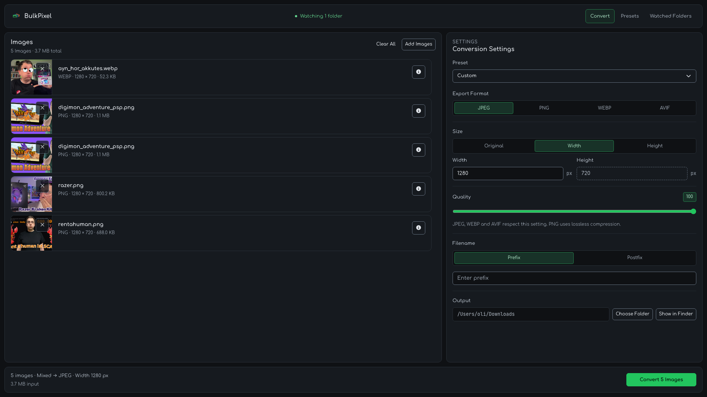
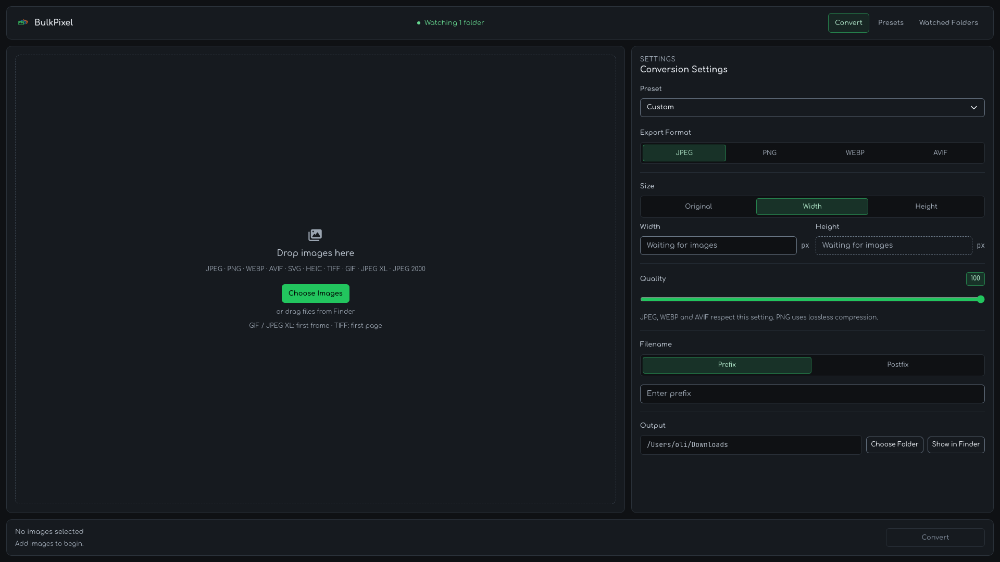
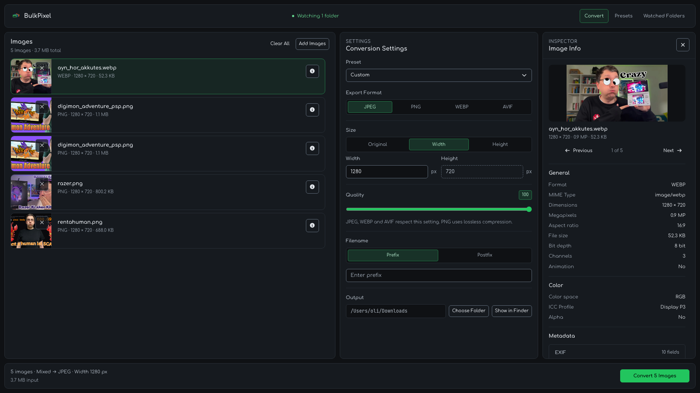
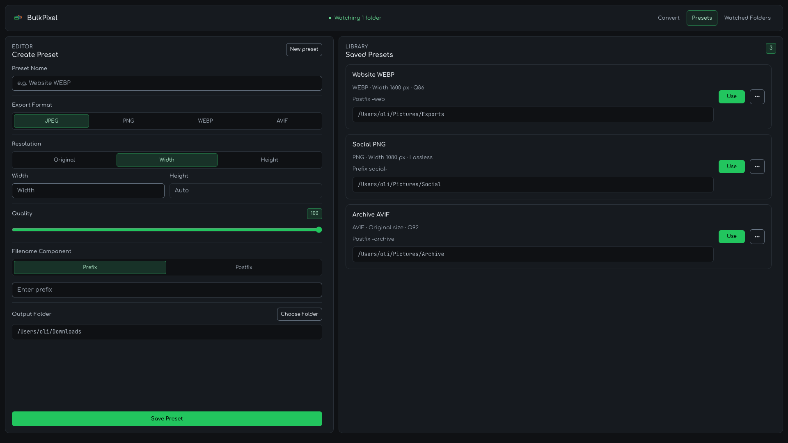
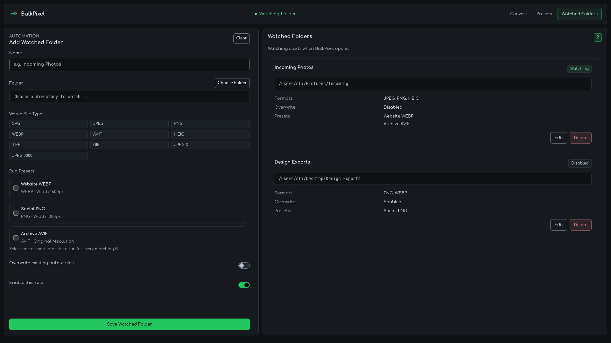
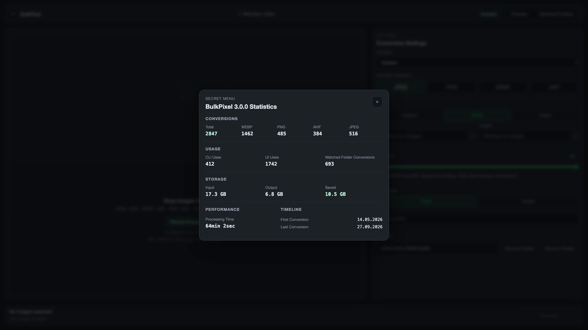

# BulkPixel 🖼️



**Convert more. Click less.**

BulkPixel is a local-first desktop app for fast batch image processing (Mac Only).  
Drop in multiple images, choose an output format, resize if needed, and export everything in one go.

Built for people who do not want a bloated image editor just to prepare assets for the web, blogs, apps, client work, or side projects.



## Why BulkPixel

Most image tools are either too heavy, too online, or too annoying for simple repetitive work.

BulkPixel focuses on the practical stuff:

- batch convert images in seconds
- resize without breaking aspect ratios
- export to modern web-friendly formats
- keep filenames predictable
- avoid accidental overwrites
- see honest file savings after conversion

It is local-first, fast, and intentionally restrained.

## Features

### Available now

- Drag and drop images into the app
- Native file picker support
- Batch conversion for multiple images at once
- Input support for `jpg`, `jpeg`, `png`, `avif`, `webp`, `svg`, `heic`, `heif`, `tif`, `tiff`, `gif`, `jxl` (JPEG XL), and `jp2` (JPEG 2000)
- Export to `jpg`, `png`, `avif` or `webp`
- Resize by width or height
- Automatic aspect-ratio preservation
- Quality control for JPEG, WEBP and AVIF
- Lossless PNG encoding that preserves 16-bit source channels, including when resizing
- Optional filename prefix or postfix (toggle between modes)
- Output folder selection
- Presets for saving reusable conversion settings
- Watched Folders for automatically running presets when new JPEG, PNG, WEBP, AVIF, SVG, HEIC, TIFF, GIF, JPEG XL, or JPEG 2000 files arrive
- Terminal CLI for scripted conversion, preset and Watched Folder management, and statistics
- Collision-safe saving with `_1`, `_2`, and so on
- Per-image and total savings analysis
- Clear success, partial-success, and error feedback

See the [supported import and export formats](docs/FORMATS.md) for the complete compatibility matrix and format-specific behavior.

## Image Inspector

Open Image Info for any loaded image to inspect its dimensions, format, color information, embedded metadata, and privacy-relevant fields without leaving the conversion workflow.



## Presets

Presets let you save complete conversion setups and reuse them later.  
A preset stores the export format, resize setting, quality, filename prefix or postfix, and output folder.

Use `Convert` for normal batch conversion. Use `Presets` to create, edit, duplicate, or delete saved setups. In the conversion settings, the preset dropdown lets you switch between `Default`, saved presets, and `Custom` when settings are changed manually.



## Watched Folders

Watched Folders monitor selected folders while BulkPixel is running. Give each rule a name, choose one or more input formats and presets, and BulkPixel automatically applies those presets when a matching file arrives directly in the folder.

Rules are stored alongside presets and statistics in BulkPixel's shared SQLite database. If a rule writes a supported format directly into another enabled Watched Folder, BulkPixel continues the conversion there automatically. Native file events are deduplicated, repeated rules stop the current chain, and every chain is limited to eight rules to prevent conversion loops. When multiple presets are selected, each preset must use a unique non-empty prefix or postfix.



## Statistics

Click the BulkPixel brand in the app header to open the hidden statistics panel. It shows the same conversion totals, CLI and UI usage, Watched Folder conversions, storage savings, processing time, and timeline as `bulkpixel stats` in the CLI. UI usage counts conversion batches with at least one successful output.



## CLI

BulkPixel also ships a `bulkpixel` command for terminal workflows.

Install BulkPixel and the CLI with Homebrew:

```sh
brew tap oliverjessner/tap
brew install --cask bulkpixel
```

See [docs/CLI.md](docs/CLI.md) for commands, flags, preset usage, overwrite rules, and statistics output.

## macOS Open With test cases

1. BulkPixel is closed:
    - Select a PNG in Finder
    - Right-click -> Open With -> BulkPixel
    - Expected: BulkPixel starts and the image appears in the queue

2. BulkPixel is already running:
    - Select multiple JPG, PNG, WEBP, or HEIC files in Finder
    - Right-click -> Open With -> BulkPixel
    - Expected: The existing app receives the files and adds them to the queue

3. Unsupported file type:
    - Open a TXT file or another unsupported file with BulkPixel
    - Expected: The file is ignored or reported as unsupported without starting a conversion

4. Duplicate file:
    - Open the same file twice with BulkPixel
    - Expected: The app does not crash and the queue remains valid. BulkPixel currently keeps one queue entry per path while it is already loaded.

## Who it is for

BulkPixel is useful for:

- bloggers and journalists preparing web images
- indie developers shipping assets quickly
- designers exporting lighter previews
- creators cleaning up folders of screenshots or thumbnails
- anyone who wants a focused desktop utility instead of a full editor

## License

MIT
